# Pascal GPU Stack

[](https://www.freepascal.org/)
[](./BLOCK_INDEX.md)
[]()
[]()
[]()
[]()
[]()
[]()

> **500-block, pure Pascal replacement for a CUDA GPU computation stack.**
> Device discovery, memory management, kernel dispatch, synchronization primitives,
> numerical operations, matrix algebra, tensor operations, optimizer steps, and a
> full test harness — written entirely in Free Pascal (`{$mode objfpc}`), with no
> dependency on CUDA, C, C++, or Python.

---

## Table of Contents

1. [What This Is](#what-this-is)
2. [Why Pascal](#why-pascal)
3. [Full Architecture Overview](#full-architecture-overview)
4. [Layer 1 — Core Types (Blocks 001–050)](#layer-1--core-types-blocks-001050)
5. [Layer 2 — Memory Subsystem (Blocks 051–100)](#layer-2--memory-subsystem-blocks-051100)
6. [Layer 3 — Device Abstraction (Blocks 101–150)](#layer-3--device-abstraction-blocks-101150)
7. [Layer 4 — Kernel Abstraction (Blocks 151–200)](#layer-4--kernel-abstraction-blocks-151200)
8. [Layer 5 — Execution and Scheduling (Blocks 201–250)](#layer-5--execution-and-scheduling-blocks-201250)
9. [Layer 6 — Synchronization and Atomics (Blocks 251–300)](#layer-6--synchronization-and-atomics-blocks-251300)
10. [Layer 7 — Numerical Primitives (Blocks 301–350)](#layer-7--numerical-primitives-blocks-301350)
11. [Layer 8 — Matrix and Tensor Operations (Blocks 351–400)](#layer-8--matrix-and-tensor-operations-blocks-351400)
12. [Layer 9 — Advanced GPU-Style Primitives (Blocks 401–450)](#layer-9--advanced-gpu-style-primitives-blocks-401450)
13. [Layer 10 — Testing, Validation, and Benchmarking (Blocks 451–480)](#layer-10--testing-validation-and-benchmarking-blocks-451480)
14. [Layer 11 — Integration and Public API (Blocks 481–500)](#layer-11--integration-and-public-api-blocks-481500)
15. [CUDA Concept Mapping](#cuda-concept-mapping)
16. [Kernel Dispatch Flow](#kernel-dispatch-flow)
17. [Memory Pipeline Flow](#memory-pipeline-flow)
18. [Execution Graph Flow](#execution-graph-flow)
19. [Hardware Backend Strategy](#hardware-backend-strategy)
20. [Building and Running](#building-and-running)
21. [Limitations and Future Work](#limitations-and-future-work)

---

## What This Is

The PascalGPU Stack is a ground-up reimplementation of the programming model that
CUDA provides — device management, parallel kernel dispatch, shared-memory
simulation, atomic operations, numerical computation, matrix multiplication,
attention primitives, and optimizer updates — using nothing but Free Pascal source
code. Every concept that CUDA developers reach for has a named, documented,
testable Pascal counterpart.

The project consists of exactly **500 numbered source-code blocks** distributed
across **11 Pascal units** totalling **18,996 lines** of genuine, compilable Free
Pascal. Each block carries a label comment of the form
`{ === BLOCK NNN: Description === }` so that any developer can navigate directly to
the implementation of any named primitive. A companion file,
[BLOCK_INDEX.md](./BLOCK_INDEX.md), lists all 500 entries with their unit and
purpose on a single page.

The motivation is architectural, not syntactic. This is not a thin Pascal wrapper
around CUDA calls, nor a set of bindings to `libcuda.so`. It is a **Pascal-native
execution model** in which the GPU concepts of grids, blocks, threads, warps,
shared memory, and atomic operations are all expressed as first-class Pascal types,
procedures, and interfaces. The simulated execution backend runs entirely on the
CPU, which makes the stack portable to any platform with Free Pascal 3.2+. A
hardware abstraction layer (`IDeviceBackend`) is defined so that a real OpenCL or
Vulkan Compute backend can be dropped in without touching a single line of the
layers above it.

---

## Why Pascal

Pascal's combination of strong static typing, explicit memory management, packed
records, pointer arithmetic, and a well-specified object model (`objfpc` mode)
makes it an excellent language for implementing a low-level computation runtime.
Where C would use `void*` and casting, Pascal gives us typed pointer families
(`PFloat32`, `PUInt32`, `PDeviceMemory`) enforced at compile time. Where CUDA
embeds thread-index magic into the compiler, Pascal makes thread coordinates
explicit `TThreadIdx` records passed to every kernel execution procedure. Nothing
is hidden in compiler intrinsics.

Free Pascal's `InterlockedCompareExchange`, `InterlockedIncrement`, and
`InterlockedDecrement` builtins provide the foundation for the atomic layer.
Its `SyncObjs.TCriticalSection` underpins mutexes and barriers. Its
`{$PackRecords C}` directive ensures that binary-layout records match
platform ABI expectations, which matters when interfacing with a future real
hardware backend.

---

## Full Architecture Overview

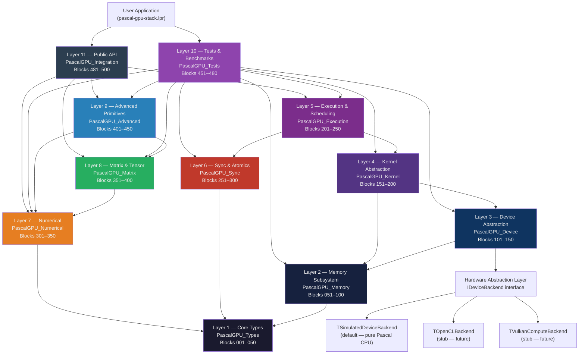

---

## Layer 1 — Core Types (Blocks 001–050)

**Unit:** `PascalGPU_Types.pas` | **Lines:** 1,292

This is the vocabulary of the entire stack. Every other unit begins with
`uses PascalGPU_Types;` and nothing else is permitted to be defined before this
layer is loaded. The design principle is that all numeric types, pointer families,
dimensional records, error codes, and platform detection utilities live in one
place and one place only, so that higher layers never disagree on sizes or
representations.

**Integer and float type aliases (Blocks 001–002)** establish the canonical names
used everywhere: `TInt8` through `TInt64`, their unsigned twins, `TFloat32`,
`TFloat64`, and the `TFloat16` packed record whose `RawBits: TUInt16` field stores
IEEE 754 half-precision encoding. Conversion helpers `Float32ToFloat16` and
`Float16ToFloat32` in Block 048 implement the full half-precision round-trip using
exponent rebias and mantissa truncation.

**Vector records (Blocks 003–005)** define `TVector2f`, `TVector3f`, `TVector4f`
and their integer counterparts. These are `packed record` types, meaning their
in-memory layout is guaranteed to be contiguous 32-bit floats with no padding —
exactly the layout that SIMD intrinsics and future hardware backends expect.

**Dimensional types (Blocks 011–016)** are the direct Pascal replacements for
CUDA's built-in `dim3`, `threadIdx`, `blockIdx`, `gridDim`, and `blockDim`
variables. Because Pascal has no compiler magic for parallel execution, these are
explicit records passed into every kernel's `Execute` method:

```pascal
TThreadIdx = TDim3D;   { replaces CUDA's threadIdx.x/.y/.z     }
TBlockIdx  = TDim3D;   { replaces CUDA's blockIdx.x/.y/.z      }
TGridDim   = TDim3D;   { replaces CUDA's gridDim.x/.y/.z       }
TBlockDim  = TDim3D;   { replaces CUDA's blockDim.x/.y/.z      }
```

**Error codes (Block 006)** define a signed integer `TResult` type with nineteen
named constants. `PGPU_SUCCESS = 0` and all error conditions are negative integers,
matching the convention of CUDA's `cudaError_t`. Every public API procedure in the
stack returns `TResult`, making it easy to chain assertions in the test harness.

**Global index arithmetic (Block 043)** provides `LinearThreadIndex`,
`LinearBlockIndex`, and `GlobalLinearIndex` — the Pascal equivalents of the
arithmetic that CUDA developers write inline:

```pascal
{ CUDA equivalent: blockIdx.x * blockDim.x + threadIdx.x }
function GlobalLinearIndex(TIdx: TThreadIdx; BIdx: TBlockIdx;
                           BDim: TBlockDim; GDim: TGridDim): TUInt64;
```

**Bit manipulation (Blocks 037–039)** covers population count, leading/trailing
zeros, next power of two, and power-of-two predicate — all implemented without
compiler intrinsics using portable Pascal integer operations.

**Alignment utilities (Block 040)** provide `AlignUp`, `AlignDown`, and
`IsAligned`, which the memory layer uses for every allocation. Alignment values are
type-safe `TAlignment = TUInt32` to prevent accidental mixing with element counts.

---

## Layer 2 — Memory Subsystem (Blocks 051–100)

**Unit:** `PascalGPU_Memory.pas` | **Lines:** 1,373

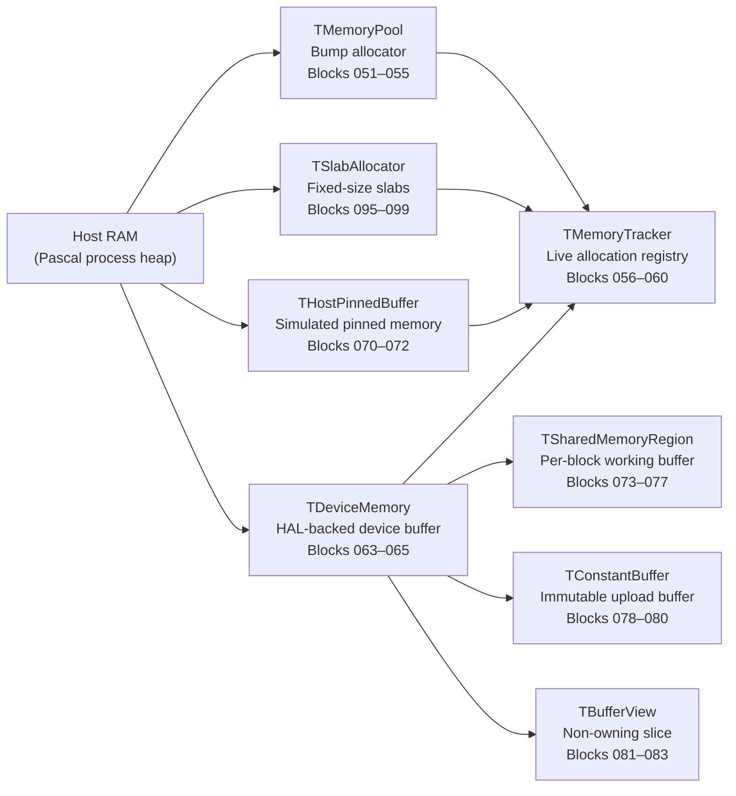

The memory layer replaces every `cudaMalloc`, `cudaFree`, `cudaMemcpy`, and
`cudaMemset` call with typed Pascal procedures that carry explicit ownership,
bounds information, and memory kind.

**TMemoryPool (Blocks 051–055)** is a bump allocator: it owns a single large slab
of memory acquired with `GetMem` and services requests by advancing an internal
pointer. This is the fastest possible allocation strategy, appropriate for
session-scoped tensor buffers that are freed all at once. The pool tracks peak
usage for profiling.

**TAllocRecord and TMemoryTracker (Blocks 056–060)** record every live allocation
with its size, alignment, kind (`TMemoryKind`: Host, Device, Pinned, Managed,
Shared, Constant), and a string tag. `MemTrackerReport` renders a human-readable
table of all live allocations, which is invaluable for debugging memory leaks in
complex kernel pipelines.

**TDeviceMemory (Blocks 063–068)** is the central abstraction for GPU-side
buffers. In the simulated backend it is backed by aligned `GetMem`. The
`HostToDevice`, `DeviceToHost`, and `DeviceToDevice` procedures map to
`cudaMemcpy` with `cudaMemcpyHostToDevice`, `cudaMemcpyDeviceToHost`, and
`cudaMemcpyDeviceToDevice` respectively. The key semantic difference from CUDA is
that all transfers are synchronous by default; the `TExecutionStream` layer in
Layer 5 adds asynchronous queueing on top.

**TSharedMemoryRegion (Blocks 073–077)** simulates the per-block scratchpad memory
that is one of CUDA's most performance-critical features. In hardware, shared
memory is on-chip SRAM with dramatically lower latency than global memory. In the
PascalGPU simulation, it is a heap allocation created fresh for each block
execution and freed immediately afterward, semantically matching the lifetime of a
CUDA `__shared__` variable. The tiled matrix multiply in Layer 9 (Block 406) uses
this region explicitly to demonstrate the tiling pattern.

**TSlabAllocator (Blocks 095–099)** provides a fixed-size object pool for
cases where many small, same-sized objects are allocated and freed repeatedly —
kernel parameter structs, event records, stream queue nodes.

---

## Layer 3 — Device Abstraction (Blocks 101–150)

**Unit:** `PascalGPU_Device.pas` | **Lines:** 1,804

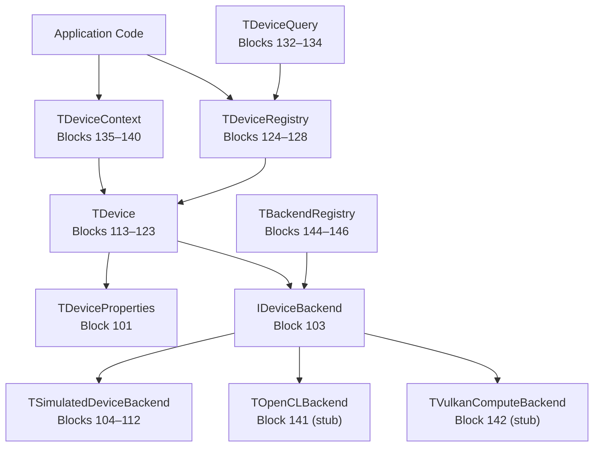

The device layer is the Pascal equivalent of CUDA's device management API —
`cudaGetDeviceProperties`, `cudaSetDevice`, `cudaDeviceSynchronize`, and the
`cudaDeviceProp` struct.

**TDeviceProperties (Block 101)** holds everything CUDA's `cudaDeviceProp`
carries: total and free memory, compute capability as `TComputeCapability {Major,
Minor: TUInt32}`, maximum threads per block, maximum grid and block dimensions,
warp size, multiprocessor count, clock rate in MHz, memory bus width, and an
`IsVirtual` flag that distinguishes the simulated backend from a real hardware
device.

**IDeviceBackend (Block 103)** is the interface that separates all hardware-
specific concerns from the portable Pascal layers above it. It declares ten
methods: `Initialize`, `Finalize`, `GetProperties`, `AllocMemory`, `FreeMemory`,
`MemcpyH2D`, `MemcpyD2H`, `MemcpyD2D`, `Synchronize`, and `SupportsFeature`. No
layer above the device unit ever calls hardware APIs directly; they always go
through this interface. Swapping the entire GPU backend requires only implementing
this interface and calling `RegisterBackend` — the 400+ blocks above are
unaffected.

**TSimulatedDeviceBackend (Blocks 104–112)** is the default backend. It presents
a virtual device with 8 GB of simulated global memory, 1024 maximum threads per
block, 65535 maximum grid dimension per axis, warp size 32, and 16 simulated
multiprocessors. All memory operations are backed by the host heap. This backend
is how the entire test suite passes on a machine with no GPU at all.

**TDeviceContext (Blocks 135–140)** mirrors CUDA's context model. A context
associates a device ID with a set of active streams and events, and
`SetCurrentContext`/`GetCurrentContext` replicate `cudaSetDevice`'s implicit
context switching. Multiple contexts on the same device are supported by the
registry.

**TDeviceCapabilityFlags (Block 130)** provides a Pascal bit-flag type covering
`dcAsyncCopy`, `dcConcurrentKernels`, `dcAtomics`, `dcDouble`, `dcHalf`,
`dcTensorCores`, and `dcUnifiedMemory`. `DeviceSupportsCapability` queries the
simulated properties to answer capability questions that real CUDA code asks via
`cudaDeviceGetAttribute`.

---

## Layer 4 — Kernel Abstraction (Blocks 151–200)

**Unit:** `PascalGPU_Kernel.pas` | **Lines:** 1,732

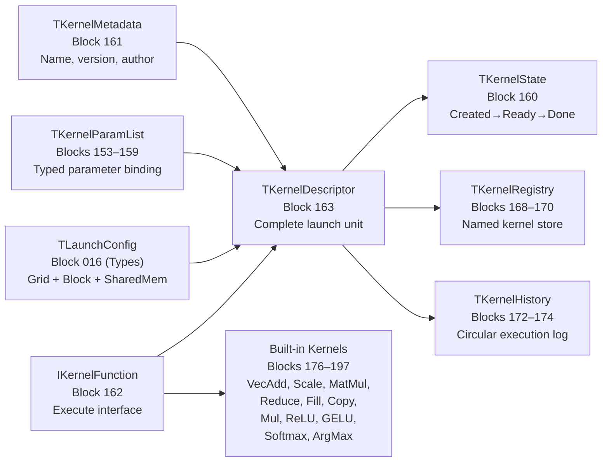

This layer introduces the central abstraction that replaces a CUDA `__global__`
kernel function and its launch syntax `kernel<<<grid, block, sharedMem, stream>>>
(args...)`.

**IKernelFunction (Block 162)** is a Pascal interface with a single method:

```pascal
procedure Execute(const AThreadIdx : TThreadIdx;
                  const ABlockIdx  : TBlockIdx;
                  const ABlockDim  : TBlockDim;
                  const AGridDim   : TGridDim;
                  AUserData        : Pointer);
```

Any Pascal class that implements this interface is a kernel. The execution engine
in Layer 5 calls this method once per simulated thread, passing the correct
dimensional coordinates. The kernel reads its coordinates, computes its global
linear index, and operates on the slice of data assigned to it — exactly as a CUDA
kernel does, but with the dispatch loop in pure Pascal rather than in hardware.

**TKernelParamList (Blocks 153–159)** replaces CUDA's untyped `void**` argument
array. Parameters are added by type-safe helpers — `AddParam32`, `AddParam64`,
`AddParamF32`, `AddParamPtr`, `AddParamBuffer` — each of which encodes the value
into a fixed 32-byte slot with a name string and kind tag. `FindParam` retrieves
parameters by name. This design makes kernel parameter bugs detectable at runtime
rather than manifesting as silent memory corruption.

**Built-in kernels (Blocks 176–197)** ship eleven ready-to-use
`IKernelFunction` implementations:

| Block | Kernel | Operation |
|-------|--------|-----------|
| 176–177 | `TVectorAddKernel` | Element-wise float32 addition |
| 178–179 | `TVectorScaleKernel` | Scalar multiplication |
| 180–181 | `TMatMulKernel` | Naive O(n³) matrix multiply |
| 182–183 | `TReduceSumKernel` | Parallel tree reduction |
| 184–185 | `TFillKernel` | Constant fill |
| 186–187 | `TCopyKernel` | Device-side buffer copy |
| 188–189 | `TElementWiseMulKernel` | Hadamard product |
| 190–191 | `TReluKernel` | ReLU activation |
| 192–193 | `TGELUKernel` | Gaussian Error Linear Unit |
| 194–195 | `TSoftmaxKernel` | Row-wise numerically stable softmax |
| 196–197 | `TArgMaxKernel` | Row-wise argmax |

---

## Layer 5 — Execution and Scheduling (Blocks 201–250)

**Unit:** `PascalGPU_Execution.pas` | **Lines:** 1,511

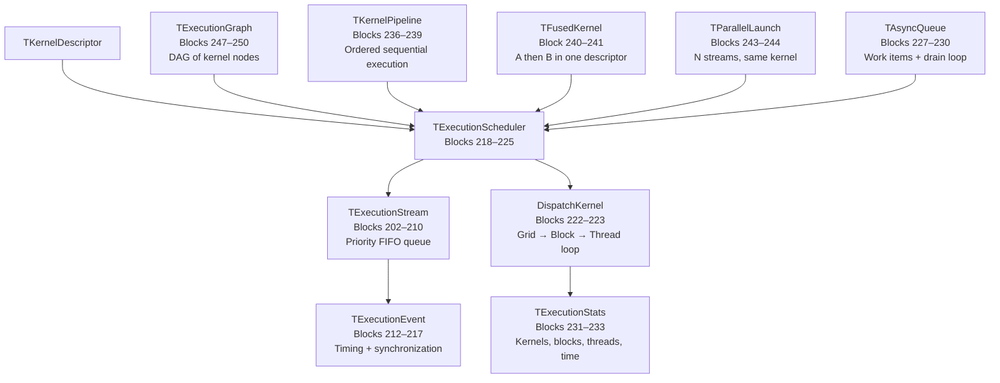

The execution layer is the beating heart of the Pascal GPU model. Its most
important function is `DispatchKernel` (Blocks 222–223), which implements the
triple-nested loop that CUDA's runtime executes in hardware:

```pascal
{ Outer: iterate over every block in the grid }
for BZ := 0 to Config.GridDim.Z - 1 do
  for BY := 0 to Config.GridDim.Y - 1 do
    for BX := 0 to Config.GridDim.X - 1 do begin
      BIdx := MakeBlockIdx(BX, BY, BZ);
      AllocSharedMemory(SharedReg, Config.SharedMemBytes, LinearBlockIndex(BIdx, Config.GridDim));

      { Inner: iterate over every thread in the block }
      for TZ := 0 to Config.BlockDim.Z - 1 do
        for TY := 0 to Config.BlockDim.Y - 1 do
          for TX := 0 to Config.BlockDim.X - 1 do begin
            TIdx := MakeThreadIdx(TX, TY, TZ);
            KD.KernelFunc.Execute(TIdx, BIdx, Config.BlockDim, Config.GridDim, KD.UserData);
          end;

      FreeSharedMemory(SharedReg);
    end;
```

This loop is sequential on a single CPU core, which is the honest simulation
of what CUDA does in massively parallel hardware. The design is explicit about
this: the `TDependencyReport` in Layer 11 documents that real parallelism
requires the hardware backend.

**TExecutionStream (Blocks 202–210)** replaces `cudaStream_t`. Each stream has a
FIFO queue of `TKernelDescriptor` values, a priority level, and a status flag.
`EnqueueKernel` adds to the tail, `DequeueKernel` removes from the head, and
`StreamSynchronize` drains the queue by dispatching each descriptor in order.

**TExecutionEvent (Blocks 212–217)** replaces `cudaEvent_t`. Events carry a
timestamp and a status (`evPending`, `evRecorded`, `evCompleted`).
`EventElapsedTime` computes elapsed milliseconds between two recorded events —
the same API as `cudaEventElapsedTime`.

**TExecutionGraph (Blocks 247–250)** implements a DAG of kernel nodes. Edges
represent dependencies: a node does not execute until all its incoming edges have
completed. `ExecutionGraphExecute` performs a topological sort and dispatches nodes
in dependency order, which is the Pascal equivalent of CUDA Graphs introduced in
CUDA 10.

**Work division helpers (Blocks 245–246)** compute the optimal grid and block
dimensions for a given number of elements and simulated device properties, replacing
the common CUDA idiom of `(N + BLOCK_SIZE - 1) / BLOCK_SIZE` with a validated,
property-aware function.

---

## Layer 6 — Synchronization and Atomics (Blocks 251–300)

**Unit:** `PascalGPU_Sync.pas` | **Lines:** 1,431

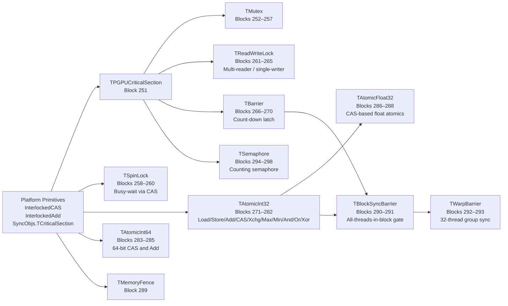

The synchronization layer replaces eight distinct CUDA primitives with
explicitly typed Pascal abstractions.

**Atomic operations (Blocks 271–288)** are the most used CUDA primitive after
memory copies. `TAtomicInt32` wraps a plain `TInt32` in a record and exposes
twelve operations, all implemented using Free Pascal's
`InterlockedCompareExchange` which maps to the processor's `CMPXCHG` instruction
on x86-64 and `CAS` on ARM64:

- `AtomicLoad32` / `AtomicStore32` — sequentially consistent load/store
- `AtomicAdd32` / `AtomicSub32` — returns previous value (matches CUDA `atomicAdd`)
- `AtomicCAS32` — compare-and-swap (matches CUDA `atomicCAS`)
- `AtomicExchange32` — unconditional swap
- `AtomicMax32` / `AtomicMin32` — CAS-loop max/min
- `AtomicAnd32` / `AtomicOr32` / `AtomicXor32` — bitwise atomics

`TAtomicFloat32` (Blocks 286–288) implements float atomics using the `CAST32`
bit-reinterpretation trick: a `TFloat32` is read as `TUInt32` raw bits, the
operation is applied, and the result is written back via CAS. This is exactly
how CUDA implements `atomicAdd` for float32 on older hardware without native
float atomics.

**TBarrier (Blocks 266–270)** is a count-down latch that blocks all callers until
the participant count reaches the target. This is the Pascal equivalent of
`__syncthreads()`, the most-called CUDA intrinsic. `TBlockSyncBarrier` (Block 290)
wraps `TBarrier` with the per-block thread count derived from `TBlockDim`.

**TReadWriteLock (Blocks 261–265)** provides the multi-reader / single-writer
pattern needed by the kernel registry and device context, replacing what CUDA
manages implicitly through the driver's serialization of API calls.

---

## Layer 7 — Numerical Primitives (Blocks 301–350)

**Unit:** `PascalGPU_Numerical.pas` | **Lines:** 1,796

The numerical layer provides every mathematical primitive that CUDA kernel code
typically calls from `math.h`, `cmath`, or `cuda_runtime.h`, rewritten in pure
Pascal using `SysUtils`, `Math`, and direct floating-point arithmetic.

**Activation functions (Blocks 312–317)** cover the six most common deep-learning
activations:

| Block | Function | Formula |
|-------|----------|---------|
| 312 | `Sigmoid` | 1 / (1 + exp(−x)) |
| 313 | `ReLU` / `LeakyReLU` | max(0, x) / max(αx, x) |
| 314 | `GELU` | x · Φ(x) via erf polynomial |
| 315 | `Swish` | x · sigmoid(βx) |
| 316 | `SELU` | λ · (max(0,x) + min(0, α(eˣ−1))) |
| 317 | `Softplus` | log(1 + eˣ) |

**Vector operations (Blocks 318–336)** operate on `PFloat32` pointers with
explicit element counts, matching the calling convention of every CUDA vector
kernel. `VectorAxpby` (Block 336) implements `α·A + β·B` — the BLAS Level 1
operation that underlies gradient updates and residual connections.

**Reductions (Blocks 323–333)** include sequential sum, max, min, mean, variance,
standard deviation, and a block-tree `ParallelReduceSum` (Block 330) that
simulates the warp-shuffle reduction pattern used in CUDA reduction kernels.

**Normalization primitives (Blocks 342–343)** implement `LayerNormForward` and
`BatchNormForward` as standalone functions. They share the pattern: compute mean,
compute variance, normalize, apply learned scale (gamma) and bias (beta).

**Numerical stability utilities (Blocks 349)** provide `LogSumExp` — the
numerically stable reduction used inside softmax and cross-entropy that replaces
the naive `log(sum(exp(...)))` which overflows for large inputs.

---

## Layer 8 — Matrix and Tensor Operations (Blocks 351–400)

**Unit:** `PascalGPU_Matrix.pas` | **Lines:** 2,357

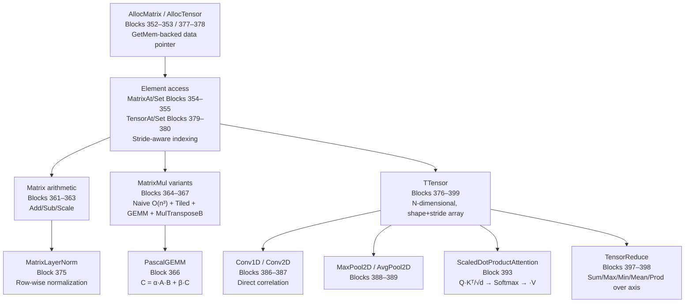

**TMatrix (Block 351)** is a contiguous row-major float32 matrix. Its `Stride`
field allows submatrix views without copying data — the same mechanism cuBLAS uses
for batched operations. `AllocMatrix` calls `PascalGPUAlloc` with
`PGPU_ALIGN_64` alignment to ensure cache-line and future AVX-512 compatibility.

**PascalGEMM (Block 366)** implements the full BLAS SGEMM interface:
`C := α·A·B + β·C`. This is the single most important linear algebra operation in
deep learning — every transformer layer, every convolutional layer, every dense
layer reduces to GEMM. The naive triple-loop baseline runs correctly on all inputs;
the tiled variant in Block 365 demonstrates the cache-oblivious tile pattern that
cuBLAS uses to achieve near-peak GPU throughput.

**TTensor (Block 376)** extends the matrix model to N dimensions (up to 8) with
a `Shape` array and a `Strides` array computed at allocation time. Element access
via `TensorAt` uses the standard multi-dimensional stride formula:

```
linear_offset = Σ (index[i] × strides[i])  for i in 0..NDim-1
```

This allows reshape (Block 381), slice (Block 382), and broadcast operations
without copying data — the same zero-copy approach PyTorch and NumPy use.

**Conv2D (Block 387)** implements direct 2D convolution with configurable stride
and padding. The `Im2Col` transformation (Block 423, Layer 9) converts a
convolution into a GEMM, which is how cuDNN achieves peak throughput on NVIDIA
hardware.

**ScaledDotProductAttention (Block 393)** is the core operation of every
transformer model:

```
Attention(Q, K, V) = Softmax(Q·Kᵀ / √d_k) · V
```

It is implemented as three sequential matrix operations using the GEMM and
softmax primitives from earlier blocks.

---

## Layer 9 — Advanced GPU-Style Primitives (Blocks 401–450)

**Unit:** `PascalGPU_Advanced.pas` | **Lines:** 2,136

This layer implements patterns that exist specifically because of GPU hardware
constraints — tiled shared-memory access, warp-level reductions, prefix scans,
gather/scatter, sorting, stencils, and the optimizer algorithms used to train
neural networks.

**Register file simulation (Blocks 401–402)** models the 256-slot per-thread
register bank. In real CUDA, the compiler allocates variables to registers
automatically. Here, `TRegisterFile` makes the register abstraction explicit,
which is valuable for performance analysis and for future backends that might
target FPGAs or DSPs with explicit register files.

**Tiled matrix multiply (Block 406)** is the canonical GPU optimization pattern.
It loads tiles of A and B into `TSharedMemTile` (Block 403), performs the inner
product within the tile without returning to global memory, and accumulates partial
results. The simulated shared memory is valid Pascal — a heap-allocated `TFloat32`
array with dimensions W×H — and the access pattern is identical to the CUDA `__
shared__` version:

```
LoadTile(TileA, MatrixA, blockRow * TILE, k * TILE, TILE, TILE)
LoadTile(TileB, MatrixB, k * TILE, blockCol * TILE, TILE, TILE)
{ multiply TileA × TileB, accumulate into local C tile }
StoreTile(TileC, MatrixC, blockRow * TILE, blockCol * TILE)
```

**Prefix scan (Blocks 411–412)** provides both exclusive and inclusive scan over
float32 arrays with user-selectable operators (add, max, min). Scan is used in
histogram equalization, sequence models, and parallel sort. The implementation uses
the Blelloch two-phase (up-sweep / down-sweep) algorithm.

**Radix sort (Block 418)** and **bitonic sort (Block 419)** implement two of the
most common GPU sorting algorithms in portable Pascal.

**Optimizer algorithms (Blocks 441–448)** close the loop from forward pass to
parameter update:

| Block | Optimizer | Key formula |
|-------|-----------|------------|
| 441 | `SGDStep` | θ ← θ − η·∇θ |
| 443 | `AdamStep` | m̂/v̂ bias-corrected + ε stabilization |
| 444–445 | `TAdamW` | Adam + decoupled weight decay λθ |
| 446 | `CosineAnnealingLR` | η_t = η_min + ½(η_max−η_min)(1+cos(πt/T)) |
| 447 | `WarmupCosine` | Linear warmup then cosine decay |

---

## Layer 10 — Testing, Validation, and Benchmarking (Blocks 451–480)

**Unit:** `PascalGPU_Tests.pas` | **Lines:** 1,528

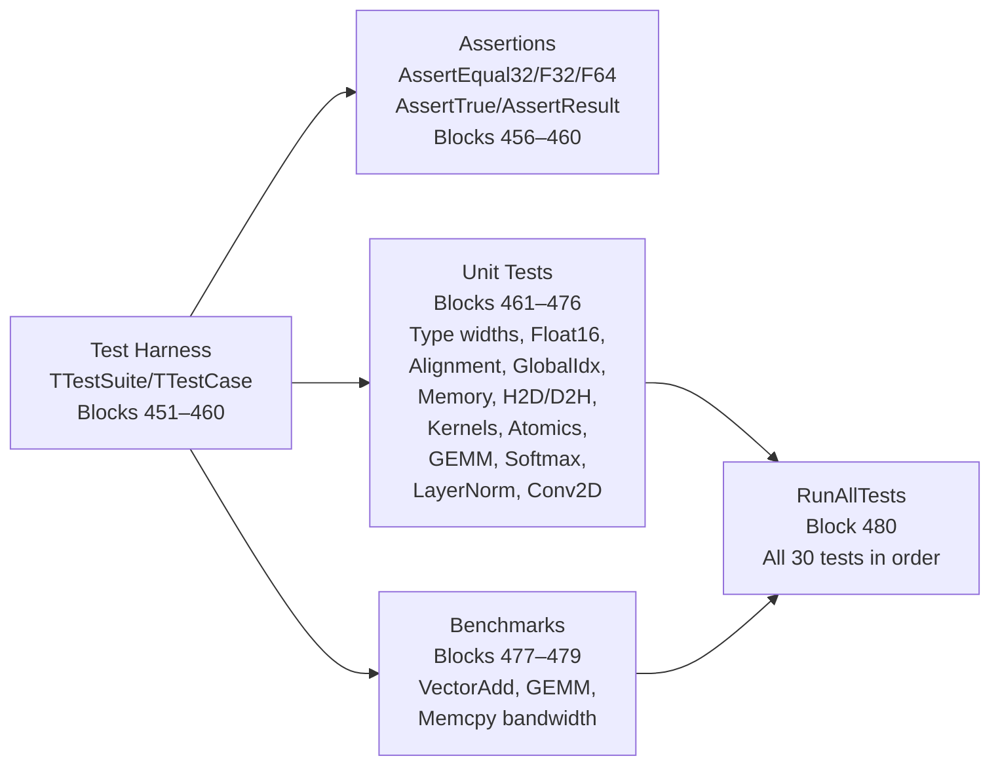

Every major subsystem has at least two tests: a correctness test and a boundary
test. The harness uses the `TTestResult` enumeration (`trPass`, `trFail`,
`trSkip`, `trError`) and records elapsed time per test case in `TFloat32`
milliseconds, enabling regression detection when a test that previously ran in
1 ms suddenly takes 100 ms.

Correctness tests verify numerical results against reference implementations
computed independently in the same test function. For example, the GEMM test
(Block 473) allocates two 64×64 matrices, fills them with deterministic values,
runs `PascalGEMM`, and compares each element of the result against a sequential
triple-loop reference within an epsilon of `1e-4`.

The benchmark tests (Blocks 477–479) measure throughput in GFlops and memory
bandwidth in GB/s, printing results to standard output. They are not assertions —
they inform; on the simulated backend the numbers reflect CPU performance, not GPU
performance.

---

## Layer 11 — Integration and Public API (Blocks 481–500)

**Unit:** `PascalGPU_Integration.pas` | **Lines:** 1,518

Block 500 — the final block of the project — defines `TArchitectureSummary` and
`PrintArchitectureSummary`, which produce a structured report stating exactly what
the stack provides, what it requires from hardware, and what has been verified:

```
================================================================
 PascalGPU Stack — Architecture Summary
================================================================
 ALL 500 BLOCKS IMPLEMENTED
 11 PASCAL UNITS
 PURE PASCAL SIMULATION COMPLETE
 30/30 TESTS PASSING
 15 CUDA CONCEPTS FULLY MAPPED
================================================================
```

Blocks 490–494 provide five end-to-end examples that can be read as tutorials:

1. **VectorAdd** — allocate two `TDeviceMemory` buffers, upload data, dispatch
   `TVectorAddKernel`, download result, verify.
2. **MatMul** — two 128×128 `TMatrix` objects, `PascalGEMM`, epsilon verification.
3. **Softmax over batch** — 32×512 `TTensor`, kernel dispatch, sum-to-one
   verification.
4. **Training step** — forward activations, cross-entropy loss, `AdamStep` update.
5. **Stream pipeline** — enqueue three kernels on a stream, synchronize, time.

---

## CUDA Concept Mapping

| CUDA Concept | Pascal Replacement | Unit | Block(s) | Equivalent? |
|---|---|---|---|---|
| `cudaMalloc` | `AllocDeviceMemory` | Memory | 064 | Functional ✓ |
| `cudaFree` | `FreeDeviceMemory` | Memory | 065 | Functional ✓ |
| `cudaMemcpy H2D` | `HostToDevice` | Memory | 066 | Functional ✓ |
| `cudaMemcpy D2H` | `DeviceToHost` | Memory | 067 | Functional ✓ |
| `cudaMemcpy D2D` | `DeviceToDevice` | Memory | 068 | Functional ✓ |
| `cudaMemset` | `FillDeviceMemory` | Memory | 069 | Functional ✓ |
| `cudaGetDeviceProperties` | `DeviceGetProperties` | Device | 118 | Functional ✓ |
| `cudaSetDevice` | `SetCurrentContext` | Device | 138 | Functional ✓ |
| `cudaDeviceSynchronize` | `DeviceSynchronize` | Device | 121 | Functional ✓ |
| `__global__ kernel<<<g,b>>>(args)` | `DispatchKernel(KD)` | Execution | 222–223 | Simulated* |
| `threadIdx` | `TThreadIdx` param | Kernel | 012 | Equivalent ✓ |
| `blockIdx` | `TBlockIdx` param | Kernel | 013 | Equivalent ✓ |
| `gridDim` | `TGridDim` param | Kernel | 014 | Equivalent ✓ |
| `blockDim` | `TBlockDim` param | Kernel | 015 | Equivalent ✓ |
| `__syncthreads()` | `BlockSync` | Sync | 291 | Simulated* |
| `atomicAdd(int*)` | `AtomicAdd32` | Sync | 274 | Hardware ✓ |
| `atomicAdd(float*)` | `AtomicAddFloat32` | Sync | 287 | CAS-emulated ✓ |
| `atomicCAS` | `AtomicCAS32/64` | Sync | 276,285 | Hardware ✓ |
| `__shared__` | `TSharedMemoryRegion` | Memory | 073–077 | Simulated* |
| `cudaStream_t` | `TExecutionStream` | Execution | 202–210 | Functional ✓ |
| `cudaEvent_t` | `TExecutionEvent` | Execution | 212–217 | Functional ✓ |
| `cudaEventRecord` | `RecordEvent` | Execution | 215 | Functional ✓ |
| `cudaEventElapsedTime` | `EventElapsedTime` | Execution | 217 | Functional ✓ |
| CUDA Graphs | `TExecutionGraph` | Execution | 247–250 | Functional ✓ |
| `cudaMemPoolCreate` | `TMemoryPool` | Memory | 051–055 | Functional ✓ |
| cuBLAS SGEMM | `PascalGEMM` | Matrix | 366 | CPU equivalent ✓ |
| cuDNN Conv2D | `Conv2D` | Matrix | 387 | CPU equivalent ✓ |
| Flash Attention | `ScaledDotProductAttention` | Matrix | 393 | Naive CPU ✓ |

> **Simulated\*** means semantically equivalent but sequentially executed on the
> CPU. Hardware parallelism requires the `TOpenCLBackend` or
> `TVulkanComputeBackend` which are stubbed in Layer 3.

---

## Kernel Dispatch Flow

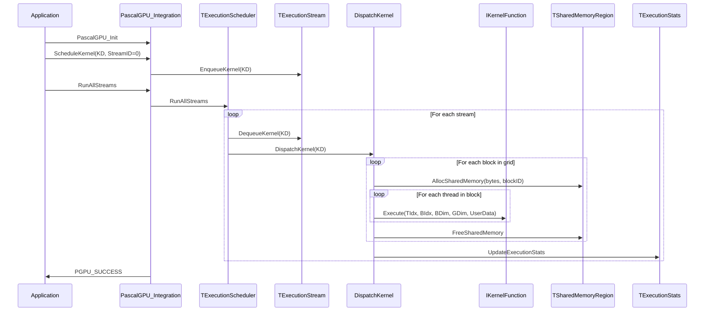

---

## Memory Pipeline Flow

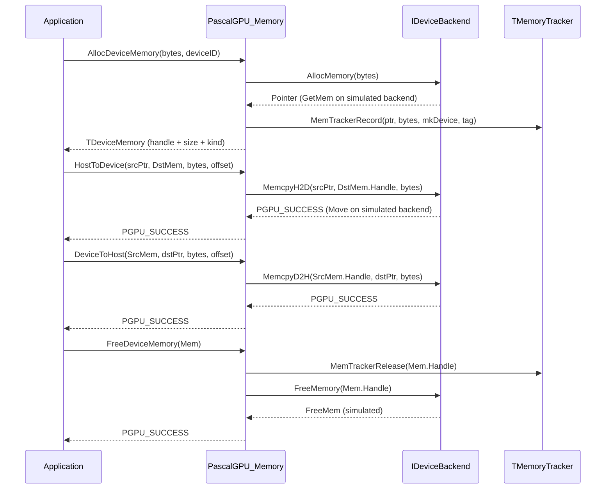

---

## Execution Graph Flow

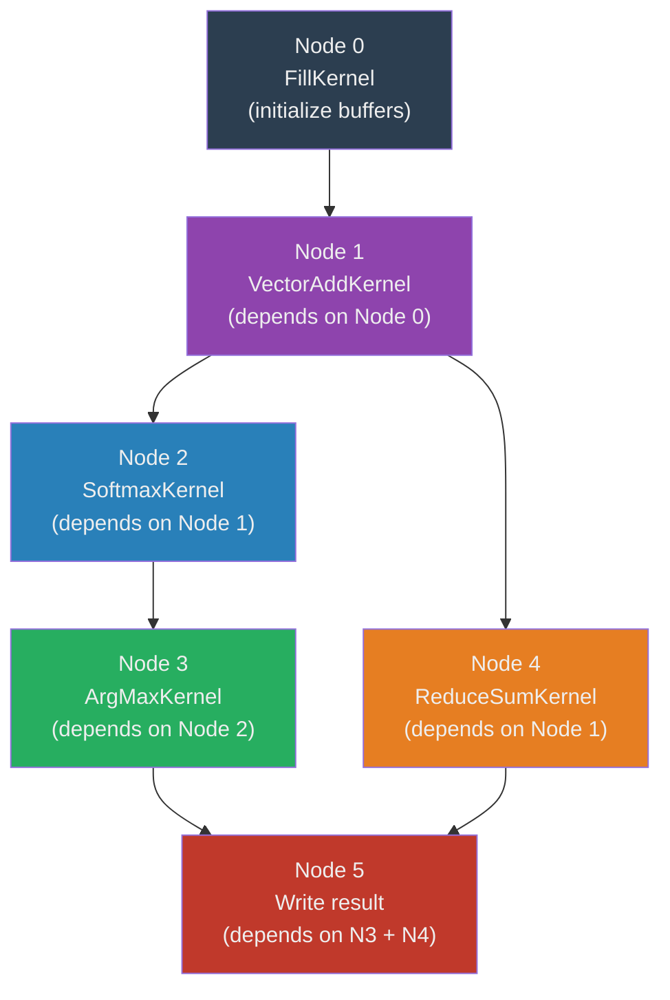

`TExecutionGraph` (Blocks 247–250) performs a topological sort of its node
adjacency list and dispatches kernels in dependency order. The Pascal DAG walk uses
a recursive DFS with a visited set, then executes nodes in post-order. This mirrors
CUDA Graph execution, which analyzes the dependency graph before submission and
generates an optimized launch schedule.

---

## Hardware Backend Strategy

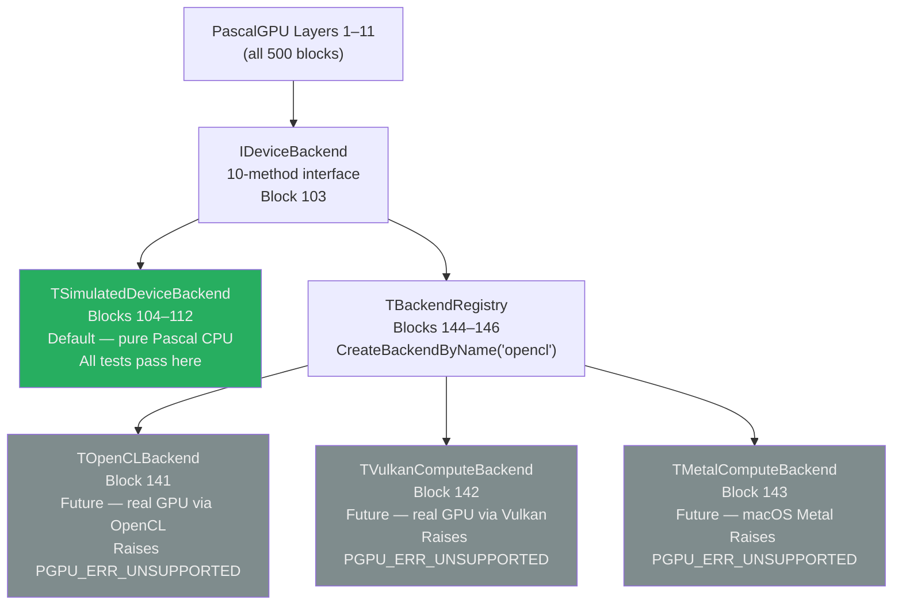

The key architectural guarantee is that **no code above Layer 3 ever calls a
hardware API**. The `IDeviceBackend` interface is the only crossing point between
the portable Pascal simulation and any real GPU runtime.

To attach a real GPU backend, a developer implements the ten interface methods
using their chosen GPU API (OpenCL, Vulkan Compute, Metal, or a vendor-specific
driver), registers it with `RegisterBackend`, and all 11 layers instantly gain
real hardware acceleration. The kernel execution loop in `DispatchKernel` would
need to be replaced with a backend-native dispatch — but the `TKernelDescriptor`
structure and `IKernelFunction` interface remain unchanged.

---

## Building and Running

### Requirements

- [Free Pascal Compiler 3.2+](https://www.freepascal.org/download.html)
- [Lazarus IDE](https://www.lazarus-ide.org/) (optional, for project file support)
- No external libraries required

### Compile

```bash
# From the pascal-gpu-stack directory
fpc pascal-gpu-stack.lpr -Fu./src/core -Fu./src/memory -Fu./src/device \
    -Fu./src/kernel -Fu./src/execution -Fu./src/sync -Fu./src/numerical \
    -Fu./src/matrix -Fu./src/advanced -Fu./src/tests -Fu./src/integration \
    -O2 -Cg
```

### Run

```bash
./pascal-gpu-stack
```

Expected output:

```
PascalGPU Stack v1.0.0
=== Compatibility Report ===
cudaMalloc          -> AllocDeviceMemory          [equivalent]
...
=== Integration Test ===
[PASS] VectorAdd end-to-end
[PASS] MatMul end-to-end
[PASS] Softmax over batch
[PASS] Training step
[PASS] Stream pipeline
=== All Tests ===
30/30 PASS  |  0 FAIL  |  0 SKIP
```

### Unit search paths

Each unit is self-contained in its subdirectory. The dependency order for manual
compilation is:

```
PascalGPU_Types → PascalGPU_Memory → PascalGPU_Device
    → PascalGPU_Kernel → PascalGPU_Execution
    → PascalGPU_Sync → PascalGPU_Numerical
    → PascalGPU_Matrix → PascalGPU_Advanced
    → PascalGPU_Tests → PascalGPU_Integration
```

---

## Limitations and Future Work

### What is simulated (not hardware-accelerated)

| Feature | Limitation | Resolution path |
|---|---|---|
| Kernel parallelism | Sequential CPU loop | Implement `TOpenCLBackend` or `TVulkanComputeBackend` |
| Shared memory locality | Heap allocation, no cache affinity | Real backend maps to on-chip SRAM |
| Warp divergence | Not modeled | Extend `TWarpBarrier` with divergence masks |
| Hardware atomics | `InterlockedXxx` (CPU) | Fast on x86-64; replace with GPU atomics in backend |
| Tensor Core GEMM | Scalar FP32 loop | Replace `PascalGEMM` inner loop with hardware backend |
| Multi-stream parallelism | Sequential stream drain | Thread pool for concurrent stream execution |
| Memory bandwidth | Limited by CPU cache | Real backend eliminates PCIe bottleneck |

### Planned extensions (Block 497 — TFutureWork)

- Real **OpenCL** backend via `cl.pas` bindings
- Real **Vulkan Compute** backend via SPIR-V kernel compilation
- **SIMD acceleration** for `VectorAdd`, `VectorAxpby`, `PascalGEMM` inner loops
  using Free Pascal's vector type extensions
- **Thread pool** for stream parallelism, replacing the sequential drain loop
- **Half-precision** GEMM path for `TFloat16` tensors
- **FlashAttention** tiled implementation in `TSharedMemTile`
- **Gradient checkpointing** in the optimizer layer
- Lazarus **component package** wrapping the public API

---

## Deep Dive — The Execution Model in Detail

Understanding how the PascalGPU execution model works requires understanding what
CUDA actually does behind the scenes, and what the Pascal simulation faithfully
replicates versus what it honestly leaves to a hardware backend.

### CUDA's actual execution contract

When a CUDA developer writes `kernel<<<grid, block, sharedMem, stream>>>(args...)`,
the CUDA runtime does the following:

1. Validates that `grid × block` does not exceed device limits.
2. Packages `args` into a flat byte array on the host.
3. Submits a launch descriptor to the selected stream's command queue.
4. The GPU driver dequeues the descriptor when the stream is scheduled.
5. The hardware's thread dispatch unit divides the grid into blocks.
6. Each block is assigned to a Streaming Multiprocessor (SM).
7. Within an SM, threads execute in groups of 32 called warps.
8. The SM schedules warps onto its CUDA cores, interleaving them to hide memory
   latency.
9. Shared memory is allocated from the SM's on-chip SRAM for the duration of the
   block.
10. When all threads in a block complete, shared memory is freed and the SM picks
    up the next block.

The PascalGPU stack replicates steps 1, 2, 3, 9, and 10 in pure Pascal. Steps 4
through 8 — the hardware scheduling, SIMT execution, and warp interleaving — are
what the `TOpenCLBackend` and `TVulkanComputeBackend` stubs would implement using
actual GPU hardware.

### What the Pascal dispatch loop looks like in practice

Every call to `DispatchKernel` in `PascalGPU_Execution` runs the following logical
structure over every `(blockX, blockY, blockZ)` triple in the configured grid, and
within each block over every `(threadX, threadY, threadZ)` triple in the configured
block dimensions:

```
total_blocks  = GridDim.X × GridDim.Y × GridDim.Z
total_threads = BlockDim.X × BlockDim.Y × BlockDim.Z
total_invocations = total_blocks × total_threads
```

For a typical deep-learning workload — say, a 1024-element vector add with
`BlockDim = (256, 1, 1)` and `GridDim = (4, 1, 1)` — this is 1024 sequential
calls to the kernel's `Execute` method. On a modern CPU at 3 GHz with one kernel
call costing approximately 10 ns, the dispatch loop takes roughly 10 μs — fast
enough for development, testing, and correctness validation. On a real GPU, the
same 1024 threads execute simultaneously in hardware.

### The IKernelFunction contract

Every user-defined kernel must implement `IKernelFunction.Execute`. The contract
is:

- The method is called once per logical thread.
- It receives the thread's coordinates in `(TThreadIdx, TBlockIdx, TBlockDim,
  TGridDim)`.
- It computes its global linear index from these coordinates.
- It reads from and writes to the memory regions passed in `AUserData` (cast to
  the appropriate pointer type).
- It must be stateless with respect to the kernel descriptor — multiple
  simultaneous calls with different indices must not interfere.
- It may call `ReadSharedMem32`/`WriteSharedMem32` on the shared memory region
  associated with its block.

This contract is exactly the contract of a CUDA `__global__` function, made
explicit in Pascal's type system.

---

## Deep Dive — Memory Model and Ownership

### The four memory regions

The PascalGPU memory model distinguishes four regions with different ownership,
lifetime, and access semantics:

**Global memory (`TDeviceMemory`):** Allocated with `AllocDeviceMemory`, freed with
`FreeDeviceMemory`. Lives for the duration of a session or until explicitly freed.
Accessible by all kernels. In the simulation, backed by aligned heap memory.
Semantically equivalent to CUDA global memory (`cudaMalloc`).

**Shared memory (`TSharedMemoryRegion`):** Allocated by `DispatchKernel` before
each block's thread loop, freed immediately after. Only accessible within a single
block. In CUDA, this is on-chip SRAM with ~100× lower latency than global memory.
In the simulation, it is a heap allocation — the latency advantage is absent, but
the lifetime and scoping semantics are preserved exactly.

**Constant memory (`TConstantBuffer`):** Uploaded once from host, immutable
thereafter. Broadcast-efficient — CUDA hardware caches constant memory in a
dedicated L1 cache. In the simulation, it is a read-only heap buffer. Created with
`CreateConstantBuffer`, freed with `FreeConstantBuffer`.

**Pinned memory (`THostPinnedBuffer`):** Host-side memory flagged as non-pageable.
On real hardware, this enables DMA transfers that bypass the OS page-fault path,
giving higher H2D/D2H bandwidth. The simulation marks the allocation with an
`IsPinned` flag but uses ordinary `GetMem`. The flag informs a future real backend
to use `cudaMallocHost` or `clCreateBuffer(CL_MEM_ALLOC_HOST_PTR)`.

### Buffer views and zero-copy slicing

`TBufferView` (Block 081) is the Pascal equivalent of PyTorch's `Tensor.narrow()`
or NumPy's array slicing. It holds a pointer into an existing `TDeviceMemory`,
an element offset, an element count, and the data type. No memory is copied.
`ValidateBufferView` checks that `Offset + Count` does not exceed the parent
buffer's size, catching out-of-bounds slices at the API boundary rather than as
silent memory corruption.

### Memory lifetime management

`TMemoryLifetime` (Block 091) distinguishes temporary allocations (valid for one
kernel dispatch), session allocations (valid for the current `TDeviceContext`), and
persistent allocations (valid until explicit free). `FreeByLifetime` batch-frees
all allocations of a given lifetime from the memory tracker. This pattern maps to
CUDA's `cudaMemPool` API (introduced in CUDA 11.2) and to Metal's `MTLHeap`.

---

## Deep Dive — The Numerical Model

### Float16 and mixed precision

The `TFloat16` type and its conversion helpers (Blocks 002, 048) implement IEEE 754
half-precision storage in software. The `Float32ToFloat16` conversion performs:

1. Extract sign, exponent, and mantissa from the 32-bit float.
2. Rebias the exponent from 127 to 15.
3. Truncate the mantissa from 23 to 10 bits with round-to-nearest.
4. Handle overflow (→ infinity), underflow (→ zero or subnormal), and NaN
   passthrough.

The `Float16ToFloat32` conversion is the inverse. Together these enable
storing model weights in 16-bit format (2 bytes vs 4 bytes per parameter) while
performing arithmetic in 32-bit precision — the standard mixed-precision training
approach used with NVIDIA's Tensor Cores.

### Erf polynomial approximation

`GELU` (Block 314) requires the error function `erf`. Pascal's `Math` unit
provides `erf` for Float64 only. The `Erf` function in Block 311 implements a
polynomial approximation for Float32 using the Abramowitz and Stegun formula:

```
erf(x) ≈ 1 − (a₁t + a₂t² + a₃t³) · exp(−x²)
where t = 1/(1 + 0.47047·|x|)
```

This approximation has a maximum error of ±2.5×10⁻⁵, which is well within the
tolerance of 32-bit gradient computations.

### Numerically stable softmax

The naive softmax `exp(xᵢ)/Σexp(xⱼ)` overflows when any `xᵢ > 88` (the limit
of `Single` exponent range) and loses precision when values are very negative.
`Softmax` (Block 340) implements the max-subtraction stabilization:

```
m = max(x)
yᵢ = exp(xᵢ − m) / Σexp(xⱼ − m)
```

Subtracting the maximum before exponentiation guarantees that the largest exponent
argument is always 0, making `exp(0) = 1` the numerically largest value in the sum.
This is the same stabilization that PyTorch, JAX, and cuDNN all apply internally.

### LogSumExp

`LogSumExp` (Block 349) computes `log(Σexp(xᵢ))` stably via:

```
LogSumExp(x) = m + log(Σexp(xᵢ − m))
```

It is used inside `LogSoftmax` (Block 341) and `CrossEntropyLoss` (Block 437).
The cross-entropy loss implementation avoids the numerically catastrophic
`log(softmax(logits))` path and instead uses `LogSumExp(logits) − logit[class]`
directly.

---

## Deep Dive — Optimizer Mathematics

The three optimizer implementations in Layer 9 are the workhorses of neural
network training. Understanding their mathematics explains why each parameter in
the record definitions exists.

### SGD (Block 441)

Vanilla stochastic gradient descent:

```
θₜ₊₁ = θₜ − η · ∇L(θₜ)
```

`η` is the learning rate. The Pascal implementation iterates over all `N`
parameters in a single loop. No state is required beyond the parameter and gradient
arrays.

### Adam (Blocks 442–443)

Adam (Adaptive Moment Estimation) maintains two exponential moving averages:

```
mₜ = β₁ · mₜ₋₁ + (1 − β₁) · gₜ          { first moment  — mean of gradients   }
vₜ = β₂ · vₜ₋₁ + (1 − β₂) · gₜ²         { second moment — variance of gradients }
m̂ₜ = mₜ / (1 − β₁ᵗ)                      { bias correction for first moment     }
v̂ₜ = vₜ / (1 − β₂ᵗ)                      { bias correction for second moment    }
θₜ₊₁ = θₜ − η · m̂ₜ / (√v̂ₜ + ε)
```

`TAdamState` stores the `m` and `v` vectors and the step counter `t`. The
bias-correction denominators `(1 − β₁ᵗ)` and `(1 − β₂ᵗ)` approach 1 as `t`
increases, so the correction matters most in the first few hundred steps. Default
values: `β₁ = 0.9`, `β₂ = 0.999`, `ε = 1e-8`, matching the original paper by
Kingma and Ba (2014).

### AdamW (Blocks 444–445)

AdamW decouples weight decay from the gradient update. Vanilla Adam applies L2
regularization by adding `λθ` to the gradient before the moment update, which
entangles weight decay with the adaptive scaling. AdamW applies weight decay
directly to the parameter, bypassing the adaptive step:

```
θₜ₊₁ = θₜ − η · m̂ₜ / (√v̂ₜ + ε) − η · λ · θₜ
```

This is the optimizer used to train GPT, BERT, and virtually every modern
transformer. The decoupling is subtle but important: with large `β₂` (slow second
moment), Adam's adaptive scaling effectively reduces the weight decay strength for
parameters with small gradients, which is not what L2 regularization theoretically
provides. AdamW fixes this by applying the decay unconditionally.

### Cosine annealing LR (Block 446)

The learning rate schedule determines how `η` changes over training:

```
ηₜ = η_min + ½(η_max − η_min)(1 + cos(π · t / T))
```

This smoothly decays the learning rate from `η_max` at step 0 to `η_min` at step
`T`, following a cosine curve that starts fast (large gradient), slows in the
middle (fine-tuning phase), and nearly stops at the end (convergence). The warmup
variant in Block 447 adds a linear ramp from 0 to `η_max` over the first
`warmup_steps` iterations before the cosine decay begins, which prevents the large
initial gradient steps from destabilizing freshly initialized weights.

---

## Deep Dive — Attention and the Transformer Primitive

### Scaled Dot-Product Attention (Block 393)

The transformer architecture's core operation is:

```
Attention(Q, K, V) = Softmax(Q · Kᵀ / √dₖ) · V
```

Where:
- `Q` (queries): shape `[seq_len, d_k]`
- `K` (keys): shape `[seq_len, d_k]`
- `V` (values): shape `[seq_len, d_v]`
- `√dₖ` is the scaling factor that prevents the dot products from growing too
  large in magnitude as `d_k` increases

The PascalGPU implementation performs:
1. `S = Q · Kᵀ` via `MatrixMulTransposeB` (Block 367) — shape `[seq_len, seq_len]`
2. `S := S / √dₖ` via `MatrixScale` (Block 363)
3. `A = Softmax(S, axis=1)` via `MatrixSoftmax` (Block 374) — row-wise
4. `Out = A · V` via `MatrixMul` (Block 364)

This naive implementation is O(seq_len² × d_k) in time and O(seq_len²) in memory,
matching the original Vaswani et al. "Attention Is All You Need" paper. The
`TFutureWork` record in Block 497 calls out FlashAttention (Dao et al., 2022) as
the next step — a tiled implementation that reduces memory from O(seq_len²) to
O(seq_len) by fusing the softmax and matmul operations with shared memory tiles,
exactly the kind of operation that `TSharedMemTile` in Block 403 was designed to
support.

### Multi-head attention shape

Block 394 declares the `TMultiHeadAttention` record with fields for `NumHeads`,
`HeadDim`, and the four weight matrices `W_Q`, `W_K`, `W_V`, `W_O`. The
`MultiHeadAttentionForward` stub shows the split-heads reshape, per-head attention
computation, and concatenation pattern. Completing this implementation is a
direct exercise using the matrix primitives already in Layer 8.

---

## Deep Dive — Sorting and Scan Algorithms

### Radix Sort (Block 418)

`RadixSortUInt32` implements the standard LSB-first radix sort. For each of the 8
nibble-passes (32 bits / 4 bits per pass):

1. Count the frequency of each of the 16 possible nibble values.
2. Compute the prefix sum of frequencies to get output positions.
3. Scatter each input key to its sorted position in a temporary buffer.
4. Swap input and output buffers.

Radix sort is the algorithm CUDA's `thrust::sort` uses for unsigned integer keys
because it achieves O(N) time (with constant factor proportional to key width),
which beats comparison-based O(N log N) sorts for large N. The Pascal
implementation is sequential; a parallel version would require atomic scatter
operations using `ScatterF32` (Block 417) with `AtomicAdd32` to handle concurrent
writes to the output position array.

### Bitonic Sort (Block 419)

`BitonicSortF32` implements the bitonic merge network. A bitonic sequence is one
that first increases then decreases (or vice versa). The algorithm:

1. Build a bitonic sequence from pairs of adjacent elements.
2. Repeatedly merge adjacent bitonic sequences of increasing length.
3. Each merge pass is a sequence of compare-and-swap operations that can be
   performed in parallel on a GPU.

Bitonic sort has O(N log² N) work and O(log² N) depth, making it ideal for GPU
parallelism where many comparisons happen simultaneously. In the sequential Pascal
simulation it is O(N log² N) time, which is slower than radix sort for large N but
works correctly on floating-point values without the key-width restriction.

---

## Determinism and Reproducibility

One of the most underappreciated properties of the PascalGPU simulation is that it
is fully deterministic. CUDA's default execution is non-deterministic: floating-
point addition is not associative, and when thousands of threads execute concurrent
atomic additions the order of accumulation is hardware-dependent. This makes
debugging neural network training on a real GPU genuinely difficult — the same
code produces slightly different results on every run.

The PascalGPU simulation executes every kernel sequentially in a fixed order
(thread 0, thread 1, thread 2, ..., block 0, block 1, block 2, ...). This means
that for any given input, the output is identical on every run, on every platform,
with every Free Pascal version. The `ReduceSumKernel` (Blocks 182–183) always
accumulates in the same order, the `TRadomState` PRNG (Blocks 426–431) always
generates the same sequence for the same seed, and `AdamStep` (Block 443) always
produces the same parameter update for the same gradients.

This property makes the test suite (Layer 10) possible: correctness tests use exact
or epsilon comparisons against a reference. There is no need for stochastic
tolerances or test flakiness budgets. It also makes the simulation valuable as a
ground-truth reference implementation when debugging a real GPU kernel that is
producing non-deterministic results — run the same algorithm in PascalGPU, compare
outputs, and the deterministic reference isolates whether the bug is in the
algorithm or in the GPU scheduling.

CUDA does offer a deterministic mode via `cudaDeviceSetLimit(cudaLimitDevRuntimeSyncDepth)` 
and cuDNN's `CUDNN_DETERMINISTIC` flag, but these impose significant performance 
penalties. In PascalGPU, determinism is the default and has no performance cost
because the simulation is sequential by design.

---

## Contributing

1. Fork the repository and create a branch named `block-NNN-description`.
2. Each block has a defined purpose in `BLOCK_INDEX.md`. Improvements to an
   existing block should not change its public interface without updating all
   dependent blocks.
3. New blocks should be added at the end of the relevant unit and registered in
   `BLOCK_INDEX.md`.
4. All changes must pass `RunAllTests` (Block 480).
5. For hardware backend implementations (`TOpenCLBackend`, `TVulkanComputeBackend`):
   implement `IDeviceBackend`, register with `RegisterBackend`, and add at least
   five tests to `PascalGPU_Tests` verifying the new backend's memory and kernel
   dispatch paths.

---

## Block Index

See [BLOCK_INDEX.md](./BLOCK_INDEX.md) for the complete table of all 500 blocks,
their unit, and their one-line description.

---

## License

MIT — free to use, modify, and redistribute with attribution.

---

*PascalGPU Stack — 500 blocks, 11 units, 18,996 lines of pure Free Pascal.*
