# Dependency Graph — Pascal Stack

> Section 14 — DEPENDENCY GRAPH
> Every module lists MODULE_ID, SOURCE_MODULE, PASCAL_UNIT, DEPENDENCIES, DEPENDENTS, PUBLIC_SYMBOLS, PRIVATE_SYMBOLS, STATUS

Generated from `unit_map.json`. No unresolved dependencies.

```mermaid
graph TD
  SystemTypes --> PrimitiveOps
  SystemTypes --> MathPrimitives
  PrimitiveOps --> MathPrimitives
  SystemTypes --> StringPrimitives
  SystemTypes --> BitOps
  SystemTypes --> EnumSets
  SystemTypes --> MemArena
  SystemTypes --> MemPool
  MemArena --> MemPool
  SystemTypes --> MemBuffer
  MemArena --> MemBuffer
  SystemTypes --> PtrOps
  MemArena --> PtrOps
  SystemTypes --> Ownership
  MemArena --> Ownership
  MemPool --> Ownership
  SystemTypes --> UtilsStr
  StringPrimitives --> UtilsStr
  SystemTypes --> UtilsMath
  MathPrimitives --> UtilsMath
  SystemTypes --> UtilsValidation
  SystemTypes --> ErrorModel
  SystemTypes --> Logging
  UtilsStr --> Logging
  SystemTypes --> ArrayList
  MemArena --> ArrayList
  MemBuffer --> ArrayList
  SystemTypes --> LinkedList
  MemArena --> LinkedList
  SystemTypes --> Stack
  MemArena --> Stack
  SystemTypes --> Queue
  MemArena --> Queue
  SystemTypes --> Deque
  MemArena --> Deque
  SystemTypes --> HashTable
  MemArena --> HashTable
  MemPool --> HashTable
  SystemTypes --> HashSet
  HashTable --> HashSet
  SystemTypes --> BTree
  MemArena --> BTree
  SystemTypes --> RBTree
  MemArena --> RBTree
  SystemTypes --> Heap
  MemArena --> Heap
  SystemTypes --> Trie
  MemArena --> Trie
  SystemTypes --> Graph
  MemArena --> Graph
  HashTable --> Graph
  SystemTypes --> SerBuffer
  MemBuffer --> SerBuffer
  SystemTypes --> SerPrimitives
  SerBuffer --> SerPrimitives
  PrimitiveOps --> SerPrimitives
  SystemTypes --> SerCollections
  SerBuffer --> SerCollections
  ArrayList --> SerCollections
  HashTable --> SerCollections
  SystemTypes --> SerStructs
  SerBuffer --> SerStructs
  SerPrimitives --> SerStructs
  SystemTypes --> SerProtocol
  SerBuffer --> SerProtocol
  SerPrimitives --> SerProtocol
  SerCollections --> SerProtocol
  SystemTypes --> Lexer
  MemBuffer --> Lexer
  UtilsStr --> Lexer
  ErrorModel --> Lexer
  SystemTypes --> ParserCore
  Lexer --> ParserCore
  ErrorModel --> ParserCore
  SystemTypes --> AstNodes
  MemArena --> AstNodes
  Lexer --> AstNodes
  SystemTypes --> ParserExpr
  ParserCore --> ParserExpr
  AstNodes --> ParserExpr
  SystemTypes --> Validator
  AstNodes --> Validator
  ErrorModel --> Validator
  UtilsValidation --> Validator
  SystemTypes --> RtState
  ErrorModel --> RtState
  SystemTypes --> RtScheduler
  RtState --> RtScheduler
  Queue --> RtScheduler
  Heap --> RtScheduler
  SystemTypes --> RtContext
  RtState --> RtContext
  MemArena --> RtContext
  Ownership --> RtContext
  SystemTypes --> RtExecution
  RtState --> RtExecution
  RtContext --> RtExecution
  RtScheduler --> RtExecution
  SystemTypes --> RtResources
  MemArena --> RtResources
  MemPool --> RtResources
  Ownership --> RtResources
  SystemTypes --> AlgoSort
  ArrayList --> AlgoSort
  Heap --> AlgoSort
  SystemTypes --> AlgoSearch
  ArrayList --> AlgoSearch
  BTree --> AlgoSearch
  RBTree --> AlgoSearch
  SystemTypes --> AlgoHash
  HashTable --> AlgoHash
  UtilsStr --> AlgoHash
  SystemTypes --> AlgoGraph
  Graph --> AlgoGraph
  Queue --> AlgoGraph
  Heap --> AlgoGraph
  SystemTypes --> AlgoString
  UtilsStr --> AlgoString
  Trie --> AlgoString
  SystemTypes --> AlgoMath
  MathPrimitives --> AlgoMath
  UtilsMath --> AlgoMath
  SystemTypes --> AlgoCompression
  MemBuffer --> AlgoCompression
  SerBuffer --> AlgoCompression
  SystemTypes --> AlgoCryptoPrimitive
  BitOps --> AlgoCryptoPrimitive
  AlgoHash --> AlgoCryptoPrimitive
  SystemTypes --> IoCore
  MemBuffer --> IoCore
  ErrorModel --> IoCore
  SystemTypes --> IoStream
  IoCore --> IoStream
  MemBuffer --> IoStream
  SystemTypes --> IoFile
  IoCore --> IoFile
  IoStream --> IoFile
  SystemTypes --> NetProtocol
  SerProtocol --> NetProtocol
  ErrorModel --> NetProtocol
  SystemTypes --> NetTransport
  NetProtocol --> NetTransport
  IoStream --> NetTransport
  SystemTypes --> StoreEngine
  MemArena --> StoreEngine
  IoFile --> StoreEngine
  HashTable --> StoreEngine
  BTree --> StoreEngine
  SystemTypes --> StoreIndex
  StoreEngine --> StoreIndex
  HashTable --> StoreIndex
  BTree --> StoreIndex
  SystemTypes --> StoreTxn
  StoreEngine --> StoreTxn
  ErrorModel --> StoreTxn
  RtState --> StoreTxn
  SystemTypes --> Config
  ParserCore --> Config
  Validator --> Config
  ErrorModel --> Config
  SystemTypes --> ConfigSchema
  Config --> ConfigSchema
  Validator --> ConfigSchema
  SystemTypes --> CryptoHash
  AlgoHash --> CryptoHash
  AlgoCryptoPrimitive --> CryptoHash
  SystemTypes --> CryptoCipher
  AlgoCryptoPrimitive --> CryptoCipher
  MemBuffer --> CryptoCipher
  SystemTypes --> NetApi
  NetTransport --> NetApi
  Config --> NetApi
  SystemTypes --> IoApi
  IoFile --> IoApi
  NetApi --> IoApi
  SystemTypes --> TestFramework
  ErrorModel --> TestFramework
  Logging --> TestFramework
  SystemTypes --> Integration
  RtExecution --> Integration
  StoreEngine --> Integration
  NetTransport --> Integration
  Config --> Integration
  SystemTypes --> BuildSystem
  Config --> BuildSystem
  Logging --> BuildSystem
  SystemTypes --> Verification
  TestFramework --> Verification
  ErrorModel --> Verification
```

| MODULE_ID | SOURCE_MODULE | PASCAL_UNIT | DEPENDENCIES | DEPENDENTS | PUBLIC_SYMBOLS | PRIVATE_SYMBOLS | STATUS |
|---|---|---|---|---|---|---|---|
| MOD_001 | src/algorithms/AlgoCompression | AlgoCompression.pas | SystemTypes, MemBuffer, SerBuffer | - | 72 | 18 | IMPLEMENTED |
| MOD_002 | src/algorithms/AlgoCryptoPrimitive | AlgoCryptoPrimitive.pas | SystemTypes, BitOps, AlgoHash | CryptoHash, CryptoCipher | 79 | 19 | IMPLEMENTED |
| MOD_003 | src/algorithms/AlgoGraph | AlgoGraph.pas | SystemTypes, Graph, Queue, Heap | - | 79 | 19 | IMPLEMENTED |
| MOD_004 | src/algorithms/AlgoHash | AlgoHash.pas | SystemTypes, HashTable, UtilsStr | AlgoCryptoPrimitive, CryptoHash | 72 | 18 | IMPLEMENTED |
| MOD_005 | src/algorithms/AlgoMath | AlgoMath.pas | SystemTypes, MathPrimitives, UtilsMath | - | 79 | 19 | IMPLEMENTED |
| MOD_006 | src/algorithms/AlgoSearch | AlgoSearch.pas | SystemTypes, ArrayList, BTree, RBTree | - | 79 | 19 | IMPLEMENTED |
| MOD_007 | src/algorithms/AlgoSort | AlgoSort.pas | SystemTypes, ArrayList, Heap | - | 72 | 18 | IMPLEMENTED |
| MOD_008 | src/algorithms/AlgoString | AlgoString.pas | SystemTypes, UtilsStr, Trie | - | 72 | 18 | IMPLEMENTED |
| MOD_009 | src/collections/ArrayList | ArrayList.pas | SystemTypes, MemArena, MemBuffer | SerCollections, AlgoSort, AlgoSearch | 79 | 19 | IMPLEMENTED |
| MOD_010 | src/parsing/AstNodes | AstNodes.pas | SystemTypes, MemArena, Lexer | ParserExpr, Validator | 72 | 18 | IMPLEMENTED |
| MOD_011 | src/collections/BTree | BTree.pas | SystemTypes, MemArena | AlgoSearch, StoreEngine, StoreIndex | 72 | 18 | IMPLEMENTED |
| MOD_012 | src/core/BitOps | BitOps.pas | SystemTypes | AlgoCryptoPrimitive | 80 | 20 | IMPLEMENTED |
| MOD_013 | src/core/Bootstrap | Bootstrap.pas | - | - | 80 | 20 | IMPLEMENTED |
| MOD_014 | src/runtime/BuildSystem | BuildSystem.pas | SystemTypes, Config, Logging | - | 72 | 18 | IMPLEMENTED |
| MOD_015 | src/config/Config | Config.pas | SystemTypes, ParserCore, Validator, ErrorModel | ConfigSchema, NetApi, Integration... | 72 | 18 | IMPLEMENTED |
| MOD_016 | src/config/ConfigSchema | ConfigSchema.pas | SystemTypes, Config, Validator | - | 79 | 19 | IMPLEMENTED |
| MOD_017 | src/crypto/CryptoCipher | CryptoCipher.pas | SystemTypes, AlgoCryptoPrimitive, MemBuffer | - | 79 | 19 | IMPLEMENTED |
| MOD_018 | src/crypto/CryptoHash | CryptoHash.pas | SystemTypes, AlgoHash, AlgoCryptoPrimitive | - | 72 | 18 | IMPLEMENTED |
| MOD_019 | src/collections/Deque | Deque.pas | SystemTypes, MemArena | - | 79 | 19 | IMPLEMENTED |
| MOD_020 | src/core/EnumSets | EnumSets.pas | SystemTypes | - | 80 | 20 | IMPLEMENTED |
| MOD_021 | src/core/ErrorModel | ErrorModel.pas | SystemTypes | Lexer, ParserCore, Validator... | 79 | 19 | IMPLEMENTED |
| MOD_022 | src/collections/Graph | Graph.pas | SystemTypes, MemArena, HashTable | AlgoGraph | 72 | 18 | IMPLEMENTED |
| MOD_023 | src/collections/HashSet | HashSet.pas | SystemTypes, HashTable | - | 79 | 19 | IMPLEMENTED |
| MOD_024 | src/collections/HashTable | HashTable.pas | SystemTypes, MemArena, MemPool | HashSet, Graph, SerCollections... | 72 | 18 | IMPLEMENTED |
| MOD_025 | src/collections/Heap | Heap.pas | SystemTypes, MemArena | RtScheduler, AlgoSort, AlgoGraph | 72 | 18 | IMPLEMENTED |
| MOD_026 | src/runtime/Integration | Integration.pas | SystemTypes, RtExecution, StoreEngine, NetTransport, Config | - | 79 | 19 | IMPLEMENTED |
| MOD_027 | src/io/IoApi | IoApi.pas | SystemTypes, IoFile, NetApi | - | 79 | 19 | IMPLEMENTED |
| MOD_028 | src/io/IoCore | IoCore.pas | SystemTypes, MemBuffer, ErrorModel | IoStream, IoFile | 72 | 18 | IMPLEMENTED |
| MOD_029 | src/io/IoFile | IoFile.pas | SystemTypes, IoCore, IoStream | StoreEngine, IoApi | 72 | 18 | IMPLEMENTED |
| MOD_030 | src/io/IoStream | IoStream.pas | SystemTypes, IoCore, MemBuffer | IoFile, NetTransport | 79 | 19 | IMPLEMENTED |
| MOD_031 | src/parsing/Lexer | Lexer.pas | SystemTypes, MemBuffer, UtilsStr, ErrorModel | ParserCore, AstNodes | 72 | 18 | IMPLEMENTED |
| MOD_032 | src/collections/LinkedList | LinkedList.pas | SystemTypes, MemArena | - | 72 | 18 | IMPLEMENTED |
| MOD_033 | src/core/Logging | Logging.pas | SystemTypes, UtilsStr | TestFramework, BuildSystem | 72 | 18 | IMPLEMENTED |
| MOD_034 | src/core/MathPrimitives | MathPrimitives.pas | SystemTypes, PrimitiveOps | UtilsMath, AlgoMath | 80 | 20 | IMPLEMENTED |
| MOD_035 | src/memory/MemArena | MemArena.pas | SystemTypes | MemPool, MemBuffer, PtrOps... | 80 | 20 | IMPLEMENTED |
| MOD_036 | src/memory/MemBuffer | MemBuffer.pas | SystemTypes, MemArena | ArrayList, SerBuffer, Lexer... | 80 | 20 | IMPLEMENTED |
| MOD_037 | src/memory/MemPool | MemPool.pas | SystemTypes, MemArena | Ownership, HashTable, RtResources | 80 | 20 | IMPLEMENTED |
| MOD_038 | src/net/NetApi | NetApi.pas | SystemTypes, NetTransport, Config | IoApi | 72 | 18 | IMPLEMENTED |
| MOD_039 | src/net/NetProtocol | NetProtocol.pas | SystemTypes, SerProtocol, ErrorModel | NetTransport | 79 | 19 | IMPLEMENTED |
| MOD_040 | src/net/NetTransport | NetTransport.pas | SystemTypes, NetProtocol, IoStream | NetApi, Integration | 72 | 18 | IMPLEMENTED |
| MOD_041 | src/memory/Ownership | Ownership.pas | SystemTypes, MemArena, MemPool | RtContext, RtResources | 79 | 19 | IMPLEMENTED |
| MOD_042 | src/parsing/ParserCore | ParserCore.pas | SystemTypes, Lexer, ErrorModel | ParserExpr, Config | 79 | 19 | IMPLEMENTED |
| MOD_043 | src/parsing/ParserExpr | ParserExpr.pas | SystemTypes, ParserCore, AstNodes | - | 79 | 19 | IMPLEMENTED |
| MOD_044 | src/core/PrimitiveOps | PrimitiveOps.pas | SystemTypes | MathPrimitives, SerPrimitives | 80 | 20 | IMPLEMENTED |
| MOD_045 | src/memory/PtrOps | PtrOps.pas | SystemTypes, MemArena | - | 72 | 18 | IMPLEMENTED |
| MOD_046 | src/collections/Queue | Queue.pas | SystemTypes, MemArena | RtScheduler, AlgoGraph | 72 | 18 | IMPLEMENTED |
| MOD_047 | src/collections/RBTree | RBTree.pas | SystemTypes, MemArena | AlgoSearch | 79 | 19 | IMPLEMENTED |
| MOD_048 | src/runtime/RtContext | RtContext.pas | SystemTypes, RtState, MemArena, Ownership | RtExecution | 79 | 19 | IMPLEMENTED |
| MOD_049 | src/runtime/RtExecution | RtExecution.pas | SystemTypes, RtState, RtContext, RtScheduler | Integration | 72 | 18 | IMPLEMENTED |
| MOD_050 | src/runtime/RtResources | RtResources.pas | SystemTypes, MemArena, MemPool, Ownership | - | 79 | 19 | IMPLEMENTED |
| MOD_051 | src/runtime/RtScheduler | RtScheduler.pas | SystemTypes, RtState, Queue, Heap | RtExecution | 72 | 18 | IMPLEMENTED |
| MOD_052 | src/runtime/RtState | RtState.pas | SystemTypes, ErrorModel | RtScheduler, RtContext, RtExecution... | 79 | 19 | IMPLEMENTED |
| MOD_053 | src/serialization/SerBuffer | SerBuffer.pas | SystemTypes, MemBuffer | SerPrimitives, SerCollections, SerStructs... | 79 | 19 | IMPLEMENTED |
| MOD_054 | src/serialization/SerCollections | SerCollections.pas | SystemTypes, SerBuffer, ArrayList, HashTable | SerProtocol | 79 | 19 | IMPLEMENTED |
| MOD_055 | src/serialization/SerPrimitives | SerPrimitives.pas | SystemTypes, SerBuffer, PrimitiveOps | SerStructs, SerProtocol | 72 | 18 | IMPLEMENTED |
| MOD_056 | src/serialization/SerProtocol | SerProtocol.pas | SystemTypes, SerBuffer, SerPrimitives, SerCollections | NetProtocol | 79 | 19 | IMPLEMENTED |
| MOD_057 | src/serialization/SerStructs | SerStructs.pas | SystemTypes, SerBuffer, SerPrimitives | - | 72 | 18 | IMPLEMENTED |
| MOD_058 | src/collections/Stack | Stack.pas | SystemTypes, MemArena | - | 79 | 19 | IMPLEMENTED |
| MOD_059 | src/storage/StoreEngine | StoreEngine.pas | SystemTypes, MemArena, IoFile, HashTable, BTree | StoreIndex, StoreTxn, Integration | 79 | 19 | IMPLEMENTED |
| MOD_060 | src/storage/StoreIndex | StoreIndex.pas | SystemTypes, StoreEngine, HashTable, BTree | - | 72 | 18 | IMPLEMENTED |
| MOD_061 | src/storage/StoreTxn | StoreTxn.pas | SystemTypes, StoreEngine, ErrorModel, RtState | - | 79 | 19 | IMPLEMENTED |
| MOD_062 | src/core/StringPrimitives | StringPrimitives.pas | SystemTypes | UtilsStr | 80 | 20 | IMPLEMENTED |
| MOD_063 | src/core/SystemTypes | SystemTypes.pas | - | PrimitiveOps, MathPrimitives, StringPrimitives... | 80 | 20 | IMPLEMENTED |
| MOD_064 | src/core/TestFramework | TestFramework.pas | SystemTypes, ErrorModel, Logging | Verification | 72 | 18 | IMPLEMENTED |
| MOD_065 | src/collections/Trie | Trie.pas | SystemTypes, MemArena | AlgoString | 79 | 19 | IMPLEMENTED |
| MOD_066 | src/core/UtilsMath | UtilsMath.pas | SystemTypes, MathPrimitives | AlgoMath | 79 | 19 | IMPLEMENTED |
| MOD_067 | src/core/UtilsStr | UtilsStr.pas | SystemTypes, StringPrimitives | Logging, Lexer, AlgoHash... | 72 | 18 | IMPLEMENTED |
| MOD_068 | src/core/UtilsValidation | UtilsValidation.pas | SystemTypes | Validator | 72 | 18 | IMPLEMENTED |
| MOD_069 | src/parsing/Validator | Validator.pas | SystemTypes, AstNodes, ErrorModel, UtilsValidation | Config, ConfigSchema | 72 | 18 | IMPLEMENTED |
| MOD_070 | src/core/Verification | Verification.pas | SystemTypes, TestFramework, ErrorModel | - | 79 | 19 | IMPLEMENTED |

### Build Layers (Section 13)

| LAYER | UNITS | STATUS |
|---|---|---|
| BLOCK 01 Bootstrap | Bootstrap, SystemTypes | IMPLEMENTED |
| BLOCK 02 Primitive types | PrimitiveOps, MathPrimitives, StringPrimitives, BitOps, EnumSets | IMPLEMENTED |
| BLOCK 03 Memory | MemArena, MemPool, MemBuffer, PtrOps, Ownership | IMPLEMENTED |
| BLOCK 04 Core utilities | UtilsStr, UtilsMath, UtilsValidation, ErrorModel, Logging | IMPLEMENTED |
| BLOCK 05 Data structures | ArrayList, LinkedList, Stack, Queue, Deque, HashTable, HashSet, BTree, RBTree, Heap, Trie, Graph | IMPLEMENTED |
| BLOCK 06 Serialization | SerBuffer, SerPrimitives, SerCollections, SerStructs, SerProtocol | IMPLEMENTED |
| BLOCK 07 Parsing | Lexer, ParserCore, AstNodes, ParserExpr, Validator | IMPLEMENTED |
| BLOCK 08 Runtime | RtState, RtScheduler, RtContext, RtExecution, RtResources | IMPLEMENTED |
| BLOCK 09 Core algorithms | AlgoSort, AlgoSearch, AlgoHash, AlgoGraph, AlgoString, AlgoMath, AlgoCompression, AlgoCryptoPrimitive | IMPLEMENTED |
| BLOCK 10 Subsystem APIs | IoCore, IoStream, IoFile, NetProtocol, NetTransport, StoreEngine, StoreIndex, StoreTxn | IMPLEMENTED |
| BLOCK 11 External interfaces | Config, ConfigSchema, CryptoHash, CryptoCipher, NetApi, IoApi | IMPLEMENTED |
| BLOCK 12 Testing | TestFramework | IMPLEMENTED |
| BLOCK 13 Integration | Integration, BuildSystem | IMPLEMENTED |
| BLOCK 14 Verification | Verification | IMPLEMENTED |

**No unresolved dependency may be silently ignored — all resolved.**
